# 计算机毕业设计Spark+SpringBoot旅游推荐系统 旅游大数据分析大屏 旅游可视化 旅游路线规划系统 旅游推荐App小程序 旅游网站 自驾游路线规划系统 自驾游推荐系统 自驾游推荐App小程序 自驾游攻略系统

## 要求
### 源码有偿一套(论文 PPT 源码+sql脚本)
### 
### 加好友前帮忙start一下，并备注github有偿获取源码
### 我的QQ号是2877135669 或者 1679232425
### 加qq好友说明（被部分  网友整得心力交瘁）：
    1.加好友务必按照格式备注
    2.避免浪费各自的时间

https://www.bilibili.com/video/BV1pm4y1d7S5?spm_id_from=333.999.0.0

## 开发技术
Hadoop、Vue.js、Spark、SpringBoot、echarts、阿里云短信、百度AI、支付宝沙箱支付、百度地图SDK、MySQL、协同过滤推荐算法(apache-mahout)

## 创新点
1.百度地图API

2.阿里云短信接口

3.Spark大屏统计数据分析

4.协同过滤算法实现景点推荐(apache-mahout包)

5.百度AI图片识别

6.多端(App/小程序+web门户网站+后台管理系统+Spark大屏)

7.前后端分离springboot+vue.js

6.模拟自驾游路线驾车

## 补充说明
适合大数据毕业设计、数据分析、爬虫、算法类计算机毕业设计

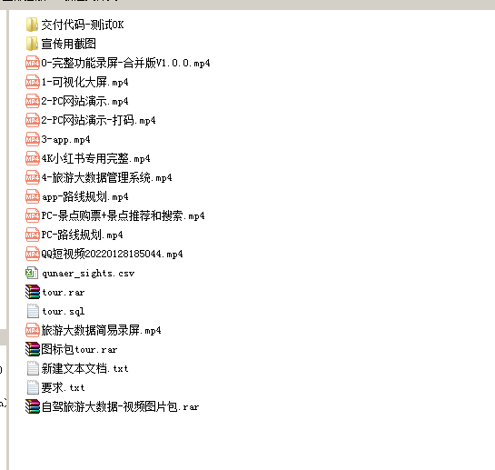

# 核心功能

1. 购买门票+保险+租车业务， 规划自驾游路线+百度路书

2. 景点推荐、景点评价等

3. 大屏实现根据销量百度热力图显示

## 大屏实现功能

1. 百度热力图：调用百度地图API结合后台景点经纬度和热力数据(销量)显示热点图

2. 热度图： 景点的销量（本平台的数据）

3. 销量图： 景点的销量（网络数据）

4. 面积图： 登录人次按照日期

5. 折线图： 近2年交易金额分析

6. 漏斗图： TOP5 热门景点

7. 三柱状图： 租车 & 门票 & 保险收入

8. 叠加柱状图： 近2年交易笔数分析

9. 三联饼图： 各省市区景点数量

10. 造一些数据

# 运行截图

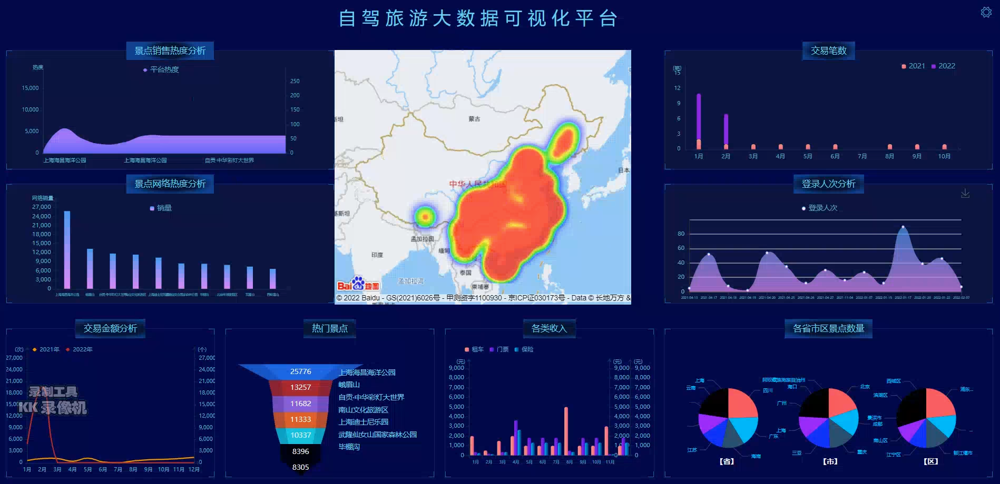

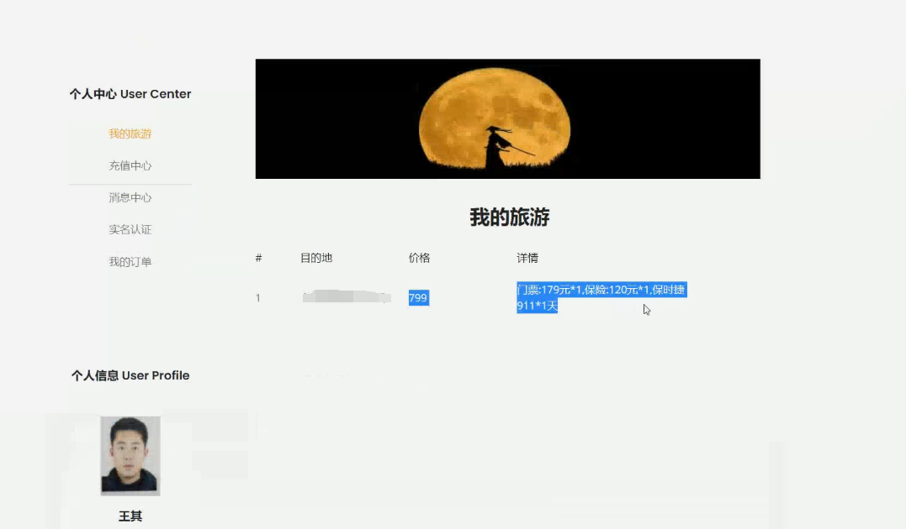

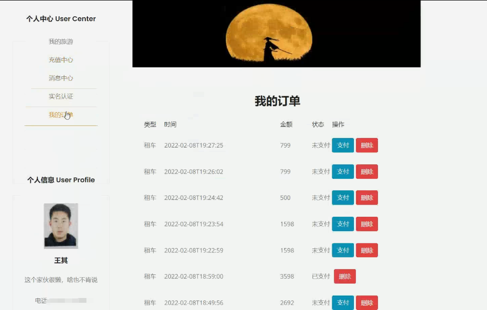

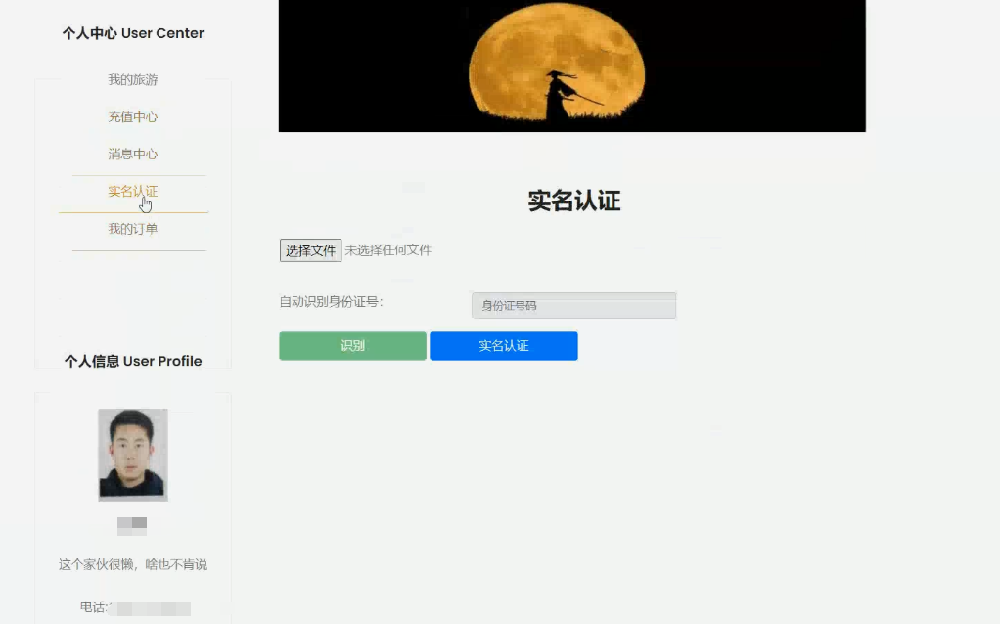

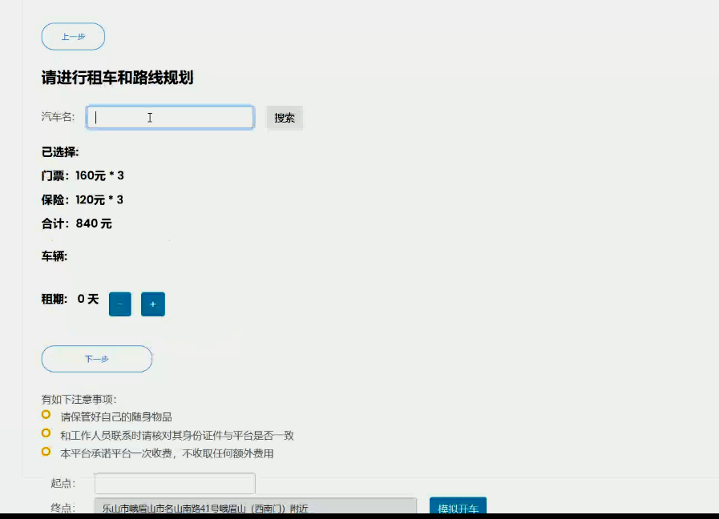

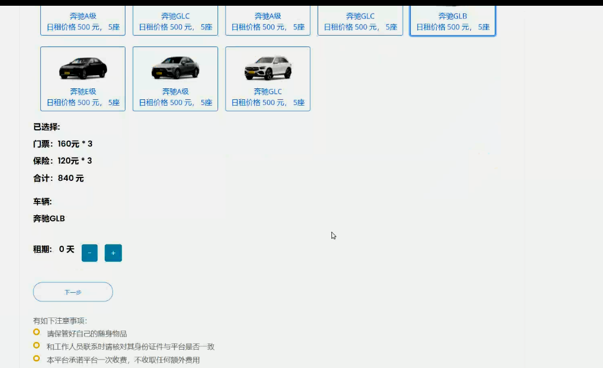

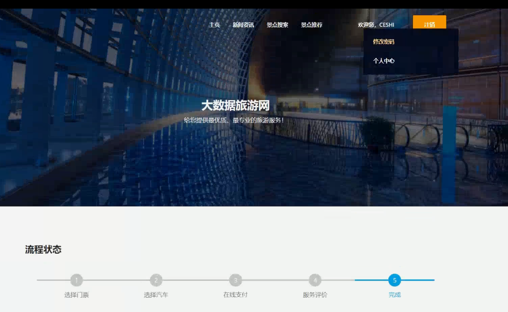

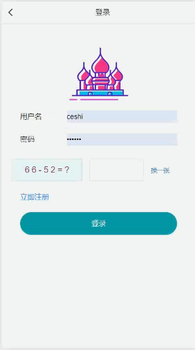

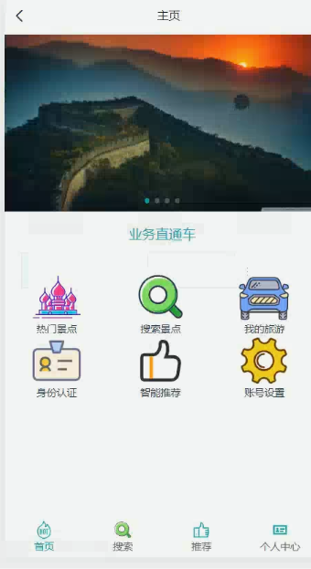

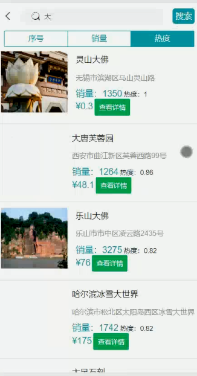

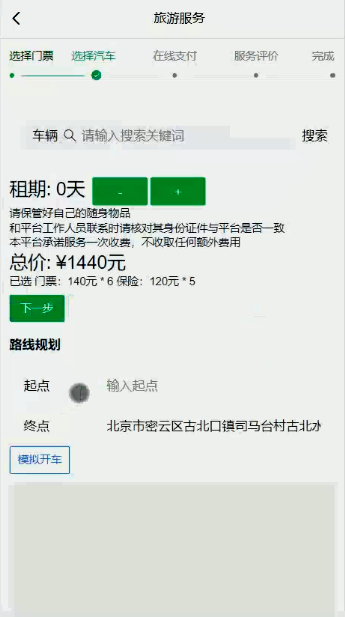

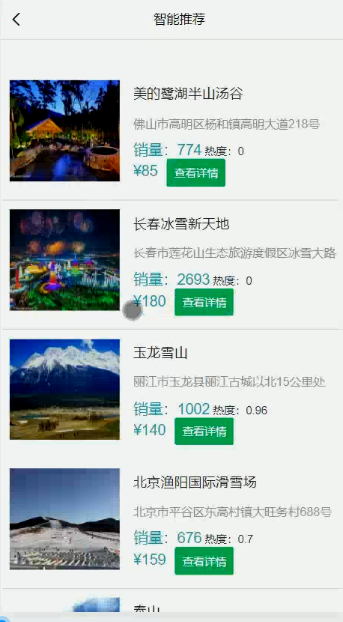

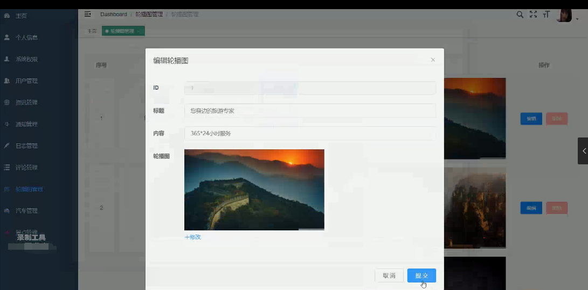

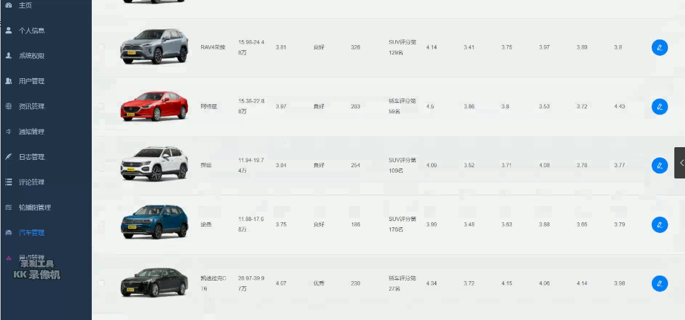

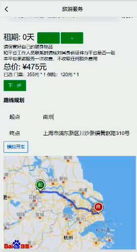

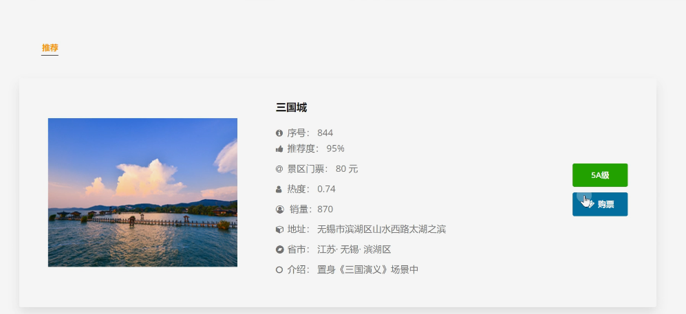

# 运行视频(B站)

https://www.bilibili.com/video/BV1pm4y1d7S5?spm_id_from=333.999.0.0

